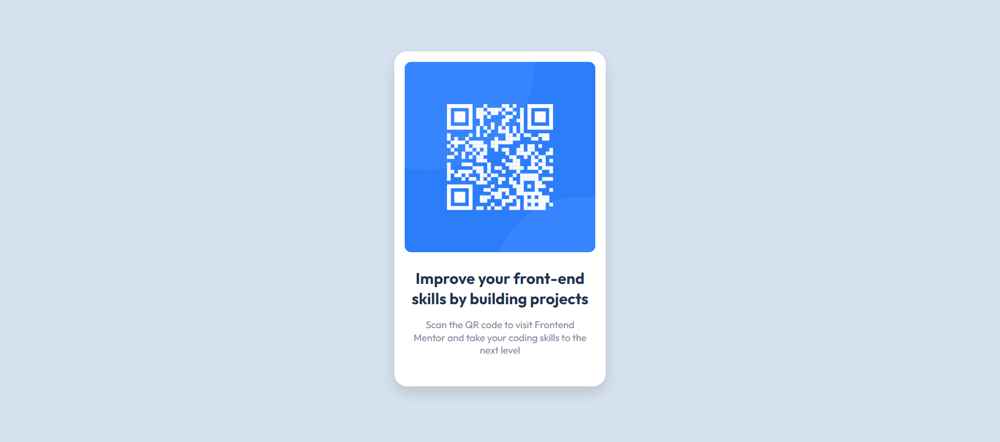

# Frontend Mentor - QR code component solution

This is a solution to the [QR code component challenge on Frontend Mentor](https://www.frontendmentor.io/challenges/qr-code-component-iux_sIO_H).

## Table of contents

- [Overview](#overview)
  - [Screenshot](#screenshot)
  - [Links](#links)
- [My process](#my-process)
  - [General Overview](#general-overview)
  - [Built with](#built-with)
  - [What I learned](#what-i-learned)
  - [Continued development](#continued-development)
  - [Useful resources](#useful-resources)
- [Author](#author)

## Overview

### Screenshot

### Links

- Solution URL: [Github](https://github.com/rostyslav-nazarenko/qr-code-component-main)
- Live Site URL: [Github Pages](https://rostyslav-nazarenko.github.io/qr-code-component-main/)

## My process

### General overview

The challenge was pretty much easy. I still have doubts not with how the result looks but more with general markdown and implemention of CSS. I will look at other solution just to know different ways of achieving the same result

### Built with

- HTML5 and CSS
- Overthinking and learning topics not connected with the challenge **:)**

### What I learned

  I previously had no experience with Git and learning it was quite a fun. Especially when fixing errors and going through lots of information to fix them or atleast understand what's wrong.

  As you can see first commit message of _"first comitt"_ tells you how much I was preoccupied with the whole process :)

- Git
  - Downloading Git and Git Bash
  - Understanding what Git is and work process with Git
  - Setting local git repository
  - Learing basic commands and differences between some of them (like `git switch` and `git checkout`)
  - Working with branches, creating, merging
  - Figuring out how connected Git Bash, VS Code Git control and terminal in VSC, Github Desktop, etc. I don't understand why there're lots of apps for source control but for now I'm going to stick with Git Bash in VS Code
  - Pushing and pulling to and from Github
  

- Github
  - Setting the profile
  - Creating remote repository
  - Setting branch protection rules
  - Learning about SSH keys and how to generate one. Still have question about SSH keys. For now didn't create one
  - Creating pull requests
  - Merging branches
  - Look at issues and how to resolve them with pull request
  - Cloning other people repositries

- Markdown
  - Going through tutorial so I can create nice README file for Github
  - Learn about markdown for the first time and its usage in other apps (Obsidian) and languages (Python)

### Continued development

I only scratched the surface with Git and Github but with the help of google and online communities finding solutions is not that difficult

I still struggle with CSS and HTML. It's like I don't know some principles of good CSS and HTML, like, there's lots of information and ways to do staff. I feel that solution is just to look how other people code and I'll keep doing it.

### Useful resources

I went through tons of information and to list all would take whole day.

**So here some of them:**

- for Git and Github
  - [Git and GitHub for Beginners - Crash Course](https://www.youtube.com/watch?v=RGOj5yH7evk)
  - [Git and GitHub for Beginners Tutorial](https://www.youtube.com/watch?v=tRZGeaHPoaw)
  - [Git Tutorial for Beginners - Git & GitHub Fundamentals In Depth](https://www.youtube.com/watch?v=DVRQoVRzMIY)
  - [Github Docs](https://docs.github.com/en)

- for Markdown
  - [Markdown Turorial](https://www.markdowntutorial.com/)
  - [Introduction to Markdown in Visual Studio Code (with Markdown worksheet!)](https://www.youtube.com/watch?v=pTCROLZLhDM)

## Author

- Frontend Mentor - [Rostyslav Nazarenko](https://www.frontendmentor.io/profile/rostyslav-nazarenko)

